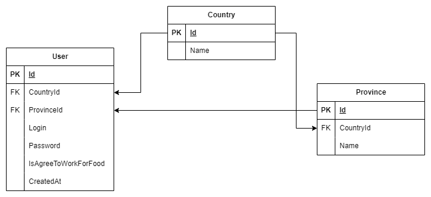

# AngularWebApi

## DB Diagram

## Work with migrations

1. Navigate to the folder: `cd AngularWebApi.Infrastructure`
2. Execute command `dotnet ef migrations add Initial --startup-project ..\AngularWebApi.Server --context AngularWebApi.Infrastructure.ApplicationDbContext -o Migrations`
3. Apply migrations `dotnet ef database update`
